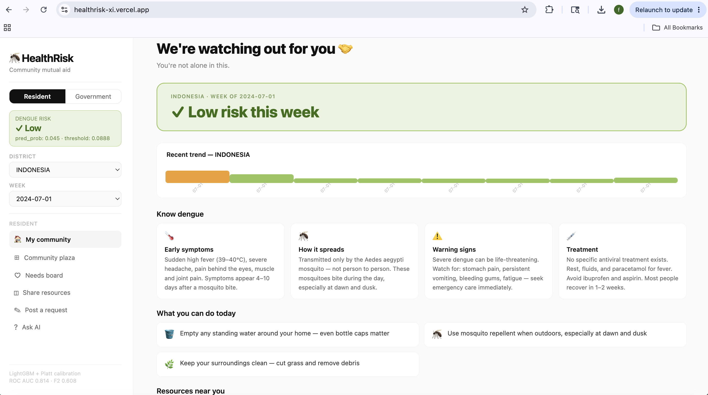
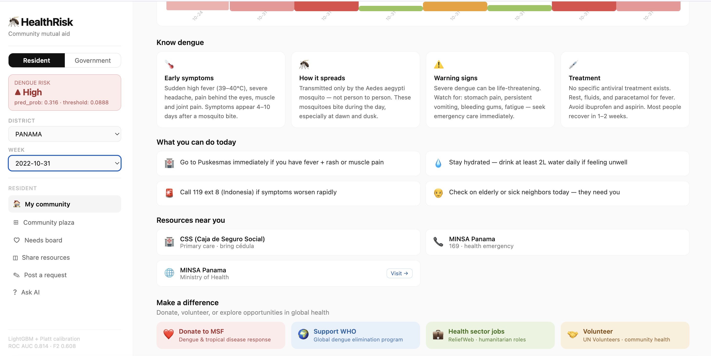
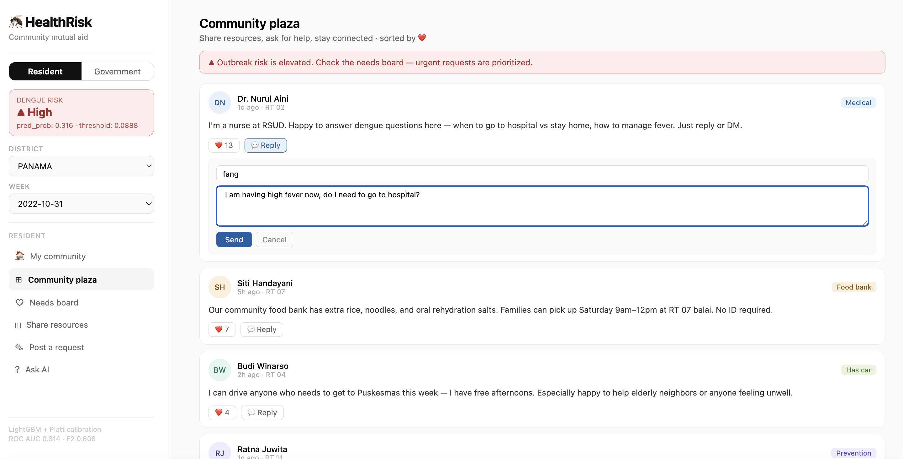
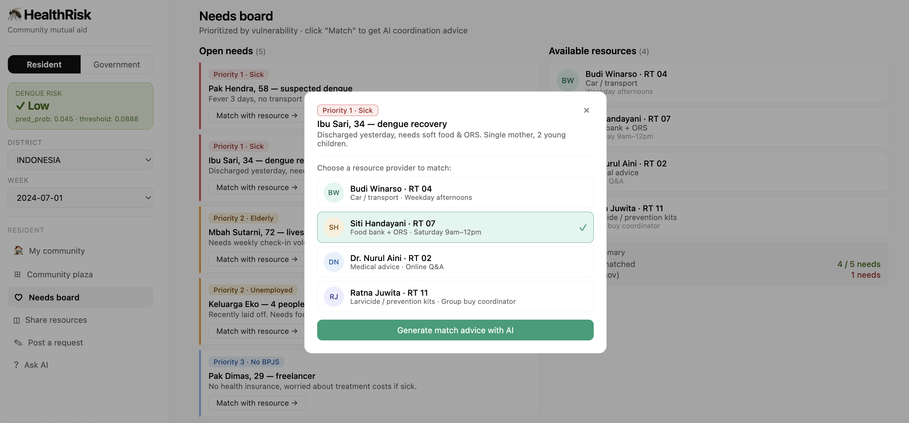
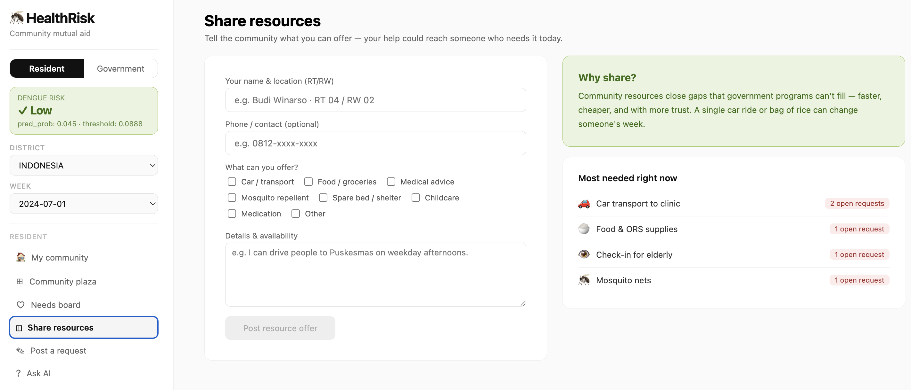
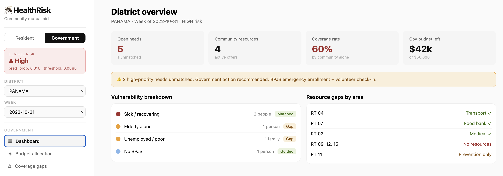
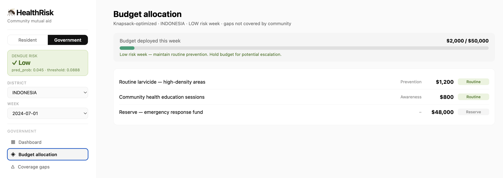
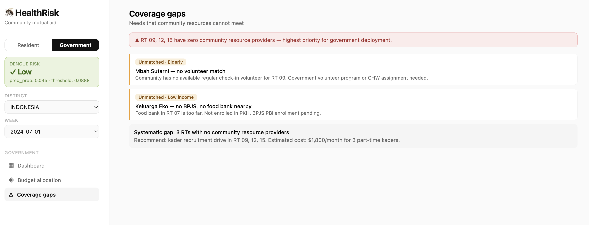
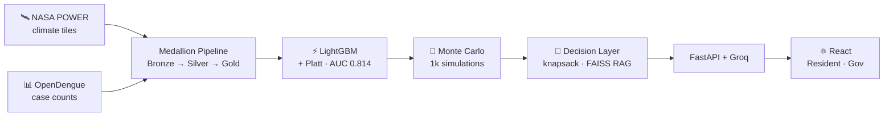

# 🦟 HealthRisk: Dengue Early Warning & Community Mutual Aid

<p align="left">
  
  
  
  
  
</p>

**→ [Live Demo](https://healthrisk-xi.vercel.app) · [API](https://healthrisk-bs57.onrender.com) · [GitHub](https://github.com/gaofang86/healthrisk)**

An end-to-end system that detects dengue outbreak risk from climate data, translates model probabilities into budget-constrained action plans, and connects vulnerable community members with local resources — with a React interface for both residents and government officers.

> *Most early warning systems stop at the alert. This one tells you what to do about it, who should do it, with what budget, and where neighbors can fill the gaps government can't.*

---

## The Problem

Most disease early warning systems stop at the alert. They tell you *that* something is coming. They don't tell you **what to do about it, who should do it, with what budget**, or where to go when it actually arrives.

More importantly, they treat the response as a government problem. In practice, communities have resources — cars, food, medical knowledge, spare time — that official programs can't mobilize fast enough. The gap between what government can deploy and what a sick family actually needs is often filled by **neighbors, not agencies**.

| Layer | What it does |
|-------|-------------|
| 🔍 **Detection** | Calibrated outbreak probability from climate + epidemiological data |
| 💰 **Allocation** | Budget-constrained action plans (0/1 knapsack) for government and individuals |
| 🤝 **Matching** | Community resource board connecting those who have with those who need |
| 📱 **Guidance** | Risk-adaptive interface that changes behaviour based on outbreak severity |

### Interface
<p align="center">
  
  
</p>
<p align="center">
  
  
</p>
<p align="center">
  
  
</p>
<p align="center">
  
  
</p>

---

## Results

<table>
<tr>
<td align="center" width="160">
<strong>F2 Score</strong><br/>
<span style="font-size:2em"><strong>0.608</strong></span><br/>
<sub>vs 0.485 NB baseline</sub>
</td>
<td align="center" width="160">
<strong>ROC AUC</strong><br/>
<span style="font-size:2em"><strong>0.814</strong></span><br/>
<sub>vs 0.680 persistence</sub>
</td>
<td align="center" width="160">
<strong>Recall</strong><br/>
<span style="font-size:2em"><strong>0.836</strong></span><br/>
<sub>F2-optimised threshold</sub>
</td>
<td align="center" width="160">
<strong>Training data</strong><br/>
<span style="font-size:2em"><strong>19K</strong></span><br/>
<sub>rows · 7 countries</sub>
</td>
<td align="center" width="160">
<strong>Climate records</strong><br/>
<span style="font-size:2em"><strong>2.34M+</strong></span><br/>
<sub>NASA POWER · 2017–2024</sub>
</td>
</tr>
</table>

### Model comparison

| Metric | **LightGBM** | NB Baseline | Persistence |
|--------|:------------:|:-----------:|:-----------:|
| F2 Score | **0.608** | 0.485 | 0.467 |
| F1 Score | **0.432** | 0.281 | 0.463 |
| Precision | **0.291** | 0.165 | 0.456 |
| Recall | **0.836** | 0.941 | 0.470 |
| ROC AUC | **0.814** | 0.515 | 0.680 |
| PR AUC | **0.474** | 0.169 | 0.301 |

Threshold 0.0888 is F2-optimised — missing an outbreak is costlier than a false alarm. LightGBM exceeds the persistence baseline by **+13 AUC points**, meaning climate and lag features add meaningful signal beyond serial continuity alone.

### Key modelling findings

| Finding | Impact |
|---------|--------|
| Temperature was proxying geography | Adding `adm_0_encoded` dropped temp to 6th place · ROC AUC 0.667 → 0.711 |
| Early stopping metric: logloss → AUC | Training extended 5 → 55 iterations |
| Adding 4 epidemiological lag features | ROC AUC +10% · PR AUC +80% |
| Platt calibration over isotonic regression | Resolved probability plateau on test set |

---

## Architecture



---

## How It Works

### 1 · Medallion pipeline (Databricks + Delta Lake)

Climate data is ingested via async tile-based API calls across **170 tiles (5°×5°)** covering Southeast Asia and South America at 1° grid resolution — ~4,250 coordinate points, three daily parameters (T2M, PRECTOTCORR, RH2M), 2017–2024, with checkpoint-based retry logic.

```
Bronze  →  raw daily records (2.34M+ rows, no transforms)
Silver  →  weekly aggregates · temp stats · precipitation · humidity · seasonal encoding (sin/cos)
Gold    →  VSI · lag features (1–3 weeks) · rolling case counts · joined with dengue labels
```

### 2 · Vector Suitability Index (VSI)

A mechanistic-ML hybrid score grounded in dengue transmission biology:

```python
temp_score     = -|z-score(temp_mean_C)|        # penalises deviation from optimal range
humidity_score = -|z-score(humidity_mean)|       # penalises deviation from optimal range
precip_z       = z-score(log1p(precip_sum_7d))   # standardised precipitation

VSI = temp_score + humidity_score + precip_z
```

The additive formulation ensures no single factor dominates — consistent with how climate conditions interact in dengue transmission.

### 3 · Decision layer: from probability to action

The model outputs a calibrated probability. That number alone is not actionable. The decision layer translates it into something a government health officer or a family in rural Indonesia can actually use.

**Monte Carlo UQ** → 1,000 Beta-distribution samples → relative risk (e.g. 3.45× baseline) + 95% CI

**0/1 Knapsack** → interventions scored by expected risk reduction per dollar → optimizer runs across all 1,000 samples → outputs specific actions, budget used, projected reduction

**FAISS RAG** → retrieves most relevant local clinics, hotlines, NGOs given district + risk tier

### 4 · Community mutual aid

The core insight: government fills gaps in bulk, but can't mobilize fast enough for individuals. A neighbor with a car can get someone to a clinic in 20 minutes.

```
Residents post resources  →  residents post needs  →  needs matched by vulnerability priority
         ↓
Government sees what community can't cover  →  budget fills only the gaps
         ↓
No duplication · maximum marginal impact per dollar
```

**Vulnerability priority:** sick/recovering → elderly alone → unemployed/low income → no BPJS

### 5 · Risk-adaptive interface

| Risk tier | Interface behaviour |
|-----------|-------------------|
| 🟢 Low | Routine prevention · community plaza · resource sharing |
| 🟡 Moderate | Targeted action steps · elevated needs monitoring |
| 🟠 High | Urgent guidance · needs board prioritized · government alert |
| 🔴 Critical | Emergency protocols · hospital directions · full resource deployment |

---

## Top Features by Importance

| Rank | Feature | Importance | Notes |
|------|---------|:----------:|-------|
| 1 | `cases_roll28` | 244 | Strongest signal — outbreaks are serially continuous |
| 2 | `cases_lag_7d` | 243 | 7-day lag case count |
| 3 | `cases_lag_21d` | 211 | 21-day lag case count |
| 4 | `temp_mean_C` | 208 | Climate signal (after geography confound removed) |
| 5 | `month_cos` | 201 | Seasonal periodicity |
| 6 | `adm_0_encoded` | 189 | Country-level baseline rates |

---

## Data Sources

| Source | Description | Coverage |
|--------|-------------|----------|
| [NASA POWER](https://power.larc.nasa.gov/) | Daily climate — T2M, precipitation, humidity | 2017–2024 · 1° grid |
| [OpenDengue V1.3](https://github.com/OpenDengue/master-repo) | Dengue case counts by province/month | 2017–2024 · 7 countries |

Countries: Colombia, Peru, Bolivia, Indonesia, Panama, Ecuador, Argentina.

---

## Project Structure

```
healthrisk/
├── backend/                      # FastAPI · /api/risk · /api/match · /api/ask
├── frontend/
│   ├── src/App.jsx               # Full single-page React app
│   └── public/test_predictions.csv   # Real LightGBM test-set outputs (2022–2024)
├── healthrisk/
│   ├── models/                   # lgbm_model.pkl · platt_calibrator.pkl
│   ├── notebook/                 # 00_setup → 05_monte_carlo_policy
│   └── src/
│       ├── ingestion/            # climate_ingestion.py · dengue_ingestion.py
│       ├── features/             # feature_engineering.py · preprocess.py
│       ├── training/             # model.py · training.py
│       └── Decision/             # monte_carlo.py · knapsack.py · resource_discovery.py
└── render.yaml
```

---

## Local Development

**Backend**
```bash
cd backend && python -m venv venv && source venv/bin/activate
pip install -r requirements.txt
cp .env.example .env          # add GROQ_API_KEY (free at console.groq.com)
uvicorn main:app --reload     # → http://localhost:8000
```

**Frontend**
```bash
cd frontend && npm install
npm run dev                   # → http://localhost:5173
```

**ML pipeline** (Databricks)
```bash
# In Databricks, add to sys.path
sys.path.insert(0, "/Workspace/healthrisk")
# Run notebooks in order: 00 → 02 → 03 → 04 → 05
```

---

## Deployment

| Service | Platform | Config |
|---------|----------|--------|
| Backend | [Render](https://render.com) free tier | `render.yaml` · set `GROQ_API_KEY` in dashboard |
| Frontend | [Vercel](https://vercel.com) free tier | `vercel.json` · set Render URL as env var |

---

## Limitations & Future Work

- **Spatial resolution** — dengue labels at province/national level; finer grid would improve precision
- **Precision 0.291** — ~1 in 3 alerts is real; acceptable for public health screening, improvable with NDVI and land-use covariates
- **Real-time inference** — test predictions cover 2022–2024; live inference would connect to NASA POWER live API (ingestion code already exists)
- **Community matching** — currently a prototype; production would require user accounts and persistent storage
- **Coverage** — 7 countries; expanding would improve model generalization
